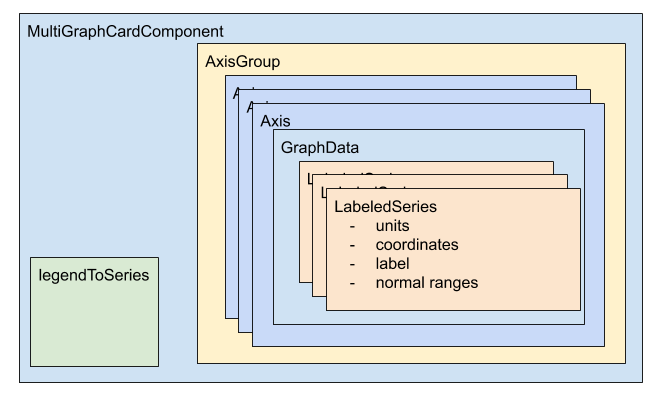
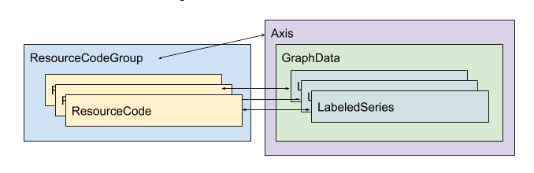

# How does the data and view model fit together for multigraph cards?

The most complex card is a multigraphcard (found in the code as MultiGraphCardComponent),
which is a card that contains one or more graphs. Below is a rough conceptual drawing
of how the various classes work together.

Every MultiGraphCardComponent has exactly one AxisGroup. The axis group contains multiple
Axis instances--one for each coordinate plane rendered in the graph. Within each Axis,
there is a single instance of GraphData which contains one or more LabeledSeries.
Each LabeledSeries corresponds to a single data series on a coordinate plane.
The variable legendToSeries in MultiGraphCard
relates the legend color for that series to each LabeledSeries in the card.

So far we've been describing a top-down view of how these classes nest together,
but the construction and instantiation of these classes actually follows a bottom-up pattern,
working from individual clinical concepts all the way up into multigraphcards. In ResourceCodeManager,
we declare individual ClinicalConcepts that we then build up into ResourceCodeGroups.
Then each ResourceCodeGroup translates directly to a single Axis.
So, the data model as it relates to the view model looks something like this:

# How do we load in data for multigraphcards?

The above covers how the concepts relate to one another, but one important piece
of information we haven't discussed so far is how, when, and where the data is
actually loaded. Upon startup, we declare all the ResourceCodes, group them into
ResourceCodeGroups, and instantiate all Axes and AxisGroups. These groupings are
part of the application's static definition. However, we do not directly load data
on startup--this might cause unnecessary delay, as the user is unlikely to view all
data for every ResourceCode, and we don't know what date range they're going to want to cover anyhow.

Instead, ResourceCodeGroup asynchronously loads data when a date range is selected
to be viewed. For each implementation for the ResourceCodeGroup class, we require
implementing the operator getResourceSet, (TODO: issue #22, fix this inheritance) which
takes in a parameter of the date range, and returns a Promise of a list of the resources
associated with the set of ResourceCodes. There will be one entry in the Promise array
for each ResourceCode that contains all the FHIR data needed to display for that class.

As its analog in the Axis class, we have a function called updateDateRange that
returns a Promise of type GraphData. When it's called, it looks at the ResourceCodeGroup,
calls getResourceSet for that group, and transforms it into the appropriate GraphData implementation.

So, to review: when the user selects the initial date, or chooses a new date range,
we propagate that event down to the MultiGraphCardComponent. Then, for each Axis in
the multigraphcard, we retrieve the FHIR resources for that information, translate them into
LabeledSeries, build the returned LabeledSeries into the approrpriately-typed GraphData,
and assign that to the internals of the Axis class.
